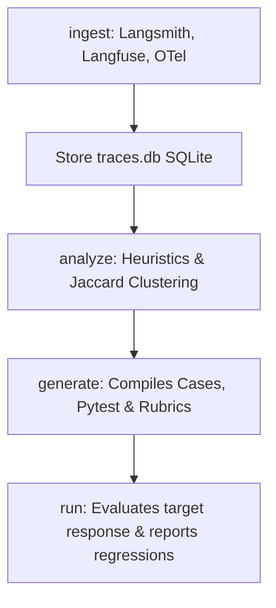

# traceval: Trace-to-Eval Compiler

[](https://opensource.org/licenses/MIT)
[](https://www.python.org/)

> "Your traces already know how your agent fails. traceval turns them into the test suite you never wrote."

Teams running LLM agents in production have observability (traces in Langfuse, LangSmith, or OpenTelemetry), but only a fraction maintain robust evals. The raw material for great tests sits unused because converting logs into regression suites is tedious and manual. 

**traceval** is a CLI and Python library that ingests agent trace logs from standard observability backends, normalizes them, automatically clusters/labels outcomes, and compiles them into a runnable pytest harness with YAML cases and LLM-as-judge rubrics.

---

## E2E Architecture Flow



---

## 60-Second Quickstart Demo

We provide an interactive demo agent and setup script so you can experience `traceval` locally in under a minute.

### 1. Clone & Run the E2E Demo Script
```bash
# Run the demo script directly (requires uv)
chmod +x examples/demo.sh
./examples/demo.sh
```

### 2. Manual CLI Step-by-Step

#### Step A: Generate & Ingest Production-style Traces
```bash
# Seed synthetic agent logs
python3 examples/make_traces.py

# Ingest into SQLite database
traceval ingest examples/synthetic_traces.jsonl -o traces.db
```

#### Step B: Analyze Failures and Hotspots
```bash
traceval analyze traces.db -o analysis/
```
*Creates `analysis/report.html` detailing outcome splits and traffic coverage.*

#### Step C: Generate Evals & Pytest harness
```bash
traceval generate traces.db -o evals/ --include-failures
```
*Generates YAML cases in `evals/cases/`, evaluation rubrics in `evals/rubrics/`, and pytest execution configurations (`conftest.py`, `test_generated.py`).*

#### Step D: Run Evaluation Suite Against Your Agent
```bash
# Run against the healthy agent target (Passing all checks)
traceval run evals/ --target examples.demo_agent.agent:invoke_agent --judge fake

# Run against a buggy agent configuration (Detects regressions and exits with status 1)
BUGGY=true traceval run evals/ --target examples.demo_agent.agent:invoke_agent --judge fake
```

---

## Core Command Reference

### `ingest`
Ingest trace telemetry files into traceval's canonical SQLite store:
```bash
traceval ingest dump.jsonl --format [otel|langfuse|langsmith|generic] -o traces.db
```

### `analyze`
Label trace outcomes and groups traces using embedding-free Jaccard and signature-based clustering:
```bash
traceval analyze traces.db [--rules custom_rules.py] [--evals evals/] -o analysis/
```

### `generate`
Generate eval case parameters, custom judge criteria, and execution code:
```bash
traceval generate traces.db -o evals/ [--per-cluster 3] [--include-failures] [--redact-hook module:fn]
```

### `run`
Run generated test cases against an HTTP endpoint or Python callable:
```bash
traceval run evals/ --target <url|module:function> [--judge fake|openai] [--compare runs/prev.json]
```

---

## Honest Limitations (v1)

- **Offline Replays**: traceval runs input-output assertions. It does not attempt to replay side effects on databases or external tools.
- **Text-only Inputs**: Telemetry parsing handles text messages and inputs; image/multimodal payloads are logged as references.
- **Static HTML**: The reporting UI is a simple, portable single-file HTML page. There is no hosted web dashboard in the v1 core package.
