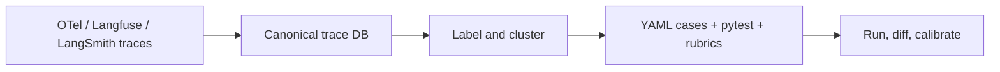

# traceval: Trace-to-Eval Compiler

<p align="center">
  
  
</p>

***"Your traces already know how your agent fails. traceval turns them into the test suite you never wrote."***

Teams running LLM agents in production have observability traces, but only a fraction maintain evals. The raw material for good tests, thousands of real traces full of edge cases and errors, sits unused because turning it into a regression suite is manual and tedious.

traceval ingests agent traces from standard sources, normalizes them into a canonical Pydantic model, labels outcomes, clusters task shapes, and compiles the result into a human-editable eval suite: YAML cases, a pytest harness, and judge rubric scaffolds.


## Quickstart

```bash
pip install traceval
traceval demo
open traceval-demo/analysis/report.html   # xdg-open on Linux
```

`traceval demo` runs the entire loop against a built-in demo agent: it generates 200 synthetic traces, ingests them, clusters the failures, compiles an eval suite, and then proves the headline claim by running that suite twice:

```text
=== Demo complete: healthy agent PASSED, buggy agent FAILED ===
Failure-cluster report: traceval-demo/analysis/report.html
Run report: traceval-demo/evals/runs/run_20260702T072029851802Z.json
Run report: traceval-demo/evals/runs/run_20260702T072030171406Z.json

Re-run any stage manually:
  traceval ingest traceval-demo/synthetic_traces.jsonl -o traceval-demo/traces.db
  traceval analyze traceval-demo/traces.db -o traceval-demo/analysis
  traceval generate traceval-demo/traces.db -o traceval-demo/evals --include-failures
  traceval run traceval-demo/evals --target traceval.demo.agent:invoke_agent --judge fake
  traceval calibrate traceval-demo/evals/runs/run_20260702T072030171406Z.json
```

## How it works



## Features

* Ingests OpenTelemetry GenAI, Langfuse, and LangSmith exports, plus generic JSONL. Malformed lines are logged as warnings instead of crashing the run (tested against corrupt fixtures in `tests/fixtures/`).
* Labels every trace with a rule-based outcome taxonomy (`success`, `tool_error`, `validation_error`, `loop`, `timeout`, `bad_output`) that you can extend with your own Python rules via `--rules`.
* Clusters task shapes with Jaccard shingle similarity, fully offline: no embeddings, no API calls. Numeric tokens are normalized, so "order 57978" and "order 12345" land in the same cluster.
* Deterministic generation: regenerating a suite from the same database is byte-identical, so evals diff cleanly in git.
* Regression cases are inverted: a failure trace asserts the failure does *not* recur (forbidden error signatures, tool-loop bounds, non-empty output), never that the agent reproduces it.
* Redacts emails, credit cards, phone numbers, and API tokens before case inputs are written (add your own scrubber with `--redact-hook`).
* `traceval run` exits nonzero on any failing case and diffs against a previous report with `--compare`, so CI can gate deploys on it.
* `traceval calibrate` measures judge-vs-human agreement per cluster and flags rubrics the automated judge scores unreliably.

## Walkthrough on your own traces

The command outputs below are real, captured from a run over the demo trace set (regenerate them with `scripts/readme-outputs.sh`). CLI output is colorized in terminals; rich auto-disables styling when the stream is not a TTY and honors the `NO_COLOR` environment variable, so piped and CI output is always plain text.

### 1. Ingest

```bash
traceval ingest traces.jsonl -o traces.db   # --format auto|otel|langfuse|langsmith|generic
```

```text
Ingested 200 traces (209 spans).
```

Malformed spans do not abort the ingest; warnings are written to `<traces.db>.log`.

### 2. Analyze

```bash
traceval analyze traces.db -o analysis
```

```text
Outcomes: success 60% · tool_error 15% · loop 10% · timeout 8% · validation_error 8%
Clusters: 8 task clusters found.
Top failure cluster: "refund stripe -> stripe_lookup -> (tool_error)" (30 traces)
Report written to analysis/report.html
```

`analysis/report.html` is the single-file page shown in the screenshot above. Pass `--evals evals/` to overlay eval coverage per cluster, and `--rules my_rules.py` to add your own labeling rules. To view it over HTTP instead of `file://`, `traceval serve analysis` starts a stdlib localhost server and prints the report URL.

Custom labeling rules, the redaction hook, and judge configuration are documented in [docs/extending.md](https://github.com/theramkm/traceval/blob/main/docs/extending.md).

### 3. Generate

```bash
traceval generate traces.db -o evals --include-failures
```

```text
Wrote 8 eval cases across 8 clusters → evals/cases/*.yaml
Wrote judge rubrics → evals/rubrics/*.md
Wrote pytest harness → evals/test_generated.py, evals/conftest.py
```

Every case is a reviewable YAML file. Golden cases assert the recorded successful behavior. Regression cases, generated from failure traces, assert the failure does **not** recur: forbidden error tokens (word-boundary matched, filtered against tokens that success traces also use), tool-loop bounds, and non-empty output. A regression case passes for any agent that avoids that failure mode; golden cases carry general bug detection.

### 4. Run

```bash
traceval run evals --target myapp.agent:invoke_agent --judge fake
```

```text
traceval Run Summary
┏━━━━━━━━━━━━━━━━━━━━━━┳━━━━━━━━━━━━┳━━━━━━━━━┳━━━━━━━━━━━━━━┓
┃ Case ID              ┃ Cluster    ┃ Outcome ┃ Latency (ms) ┃
┡━━━━━━━━━━━━━━━━━━━━━━╇━━━━━━━━━━━━╇━━━━━━━━━╇━━━━━━━━━━━━━━┩
│ c_0c422a7a__case_001 │ c_0c422a7a │  PASS   │         <0.1 │
│ c_1e5d0942__case_002 │ c_1e5d0942 │  PASS   │         <0.1 │
│ c_2c881177__case_003 │ c_2c881177 │  PASS   │         <0.1 │
│ c_361535b0__case_004 │ c_361535b0 │  PASS   │         <0.1 │
│ c_9a8a4644__case_005 │ c_9a8a4644 │  PASS   │         <0.1 │
│ c_d30af83a__case_006 │ c_d30af83a │  PASS   │         <0.1 │
│ c_d3f3b631__case_007 │ c_d3f3b631 │  PASS   │         <0.1 │
│ c_e834c13c__case_008 │ c_e834c13c │  PASS   │         <0.1 │
└──────────────────────┴────────────┴─────────┴──────────────┘
Total: 8 | Passed: 8 | Failed: 0 | Errored: 0
```

The target is an HTTP URL or a `module:function` callable; the exact request/response contract, with a copy-pasteable FastAPI example, is in [docs/targets.md](https://github.com/theramkm/traceval/blob/main/docs/targets.md). Checks cover `exact`, `contains_any`, `not_contains`, `regex`, `json_schema`, `tool_sequence`, `no_tool_loop`, and `judge`. Run reports land in `<evals_dir>/runs/` (override with `--runs-dir`); pass `--compare <previous report>` to print regressions and improvements between runs. The exit code is nonzero when any case fails.

### 5. Calibrate the judge

An LLM judge is only as trustworthy as its agreement with human judgment. `calibrate` samples judge-scored results from a run report and presents each agent output for blind pass/fail labeling in the terminal; judge verdicts stay hidden until the end so they cannot anchor you.

```bash
traceval calibrate evals/runs/run_<timestamp>.json --sample 8
```

```text
Judge Calibration Summary
┏━━━━━━━━━━━━┳━━━━━━━━━┳━━━━━━━━━━━┓
┃ Cluster    ┃ Labeled ┃ Agreement ┃
┡━━━━━━━━━━━━╇━━━━━━━━━╇━━━━━━━━━━━┩
│ c_0c422a7a │       1 │      100% │
│ c_1e5d0942 │       1 │      100% │
│ c_2c881177 │       1 │      100% │
│ c_361535b0 │       1 │      100% │
│ c_9a8a4644 │       1 │        0% │
│ c_d30af83a │       1 │      100% │
│ c_d3f3b631 │       1 │      100% │
│ c_e834c13c │       1 │      100% │
└────────────┴─────────┴───────────┘
Overall agreement: 88% on 8 case(s) | false-pass (judge OK, human not): 1 | false-fail: 0
WARNING: Judge unreliable (< 80% agreement) for clusters: c_9a8a4644. Review their rubrics before trusting automated scores.
```

False-pass counts (judge approved, human rejected) are called out because that is the dangerous direction: a lenient judge waves bad outputs into production. Clusters below `--min-agreement` (default 80%) are flagged for rubric review, and the full labels plus stats are written to `calibration.json`.

## Scripting with --json

`ingest`, `analyze`, `generate`, and `run` accept `--json`: human-readable output is suppressed and a single JSON object is printed to stdout. `run` still exits nonzero on failures.

```bash
traceval analyze traces.db --json | python -m json.tool
```

## GitHub Action

Gate deploys on your generated eval suite. The action installs traceval, runs the suite, and fails the job on any regression:

```yaml
jobs:
  agent-evals:
    runs-on: ubuntu-latest
    steps:
      - uses: actions/checkout@v4
      - uses: theramkm/traceval@v0.2.5
        with:
          evals-dir: evals/
          target: myapp.agent:invoke_agent   # or an HTTP URL
          judge: fake                        # offline; 'openai' needs an API key
```

Inputs: `evals-dir` and `target` (required); `judge`, `compare`, `only`, `runs-dir`, `traceval-version`, `python-version` (optional). For a real LLM judge, set `judge: openai` and pass `OPENAI_API_KEY` (or `GEMINI_API_KEY`) via `env:` from your repository secrets.

## Development

See [CONTRIBUTING.md](https://github.com/theramkm/traceval/blob/main/CONTRIBUTING.md) for setup.
Run the test suite with `make test` and the full gate set with `make lint`.

## Honest Limitations

* **Side-Effect Free**: traceval assertions evaluate input/output matches. It does not attempt to replay side effects (e.g., updating database records) on mock tools.
* **Text Telemetry**: The canonical model is optimized for text logs. Image or multimodal payloads in traces are logged as references.
* **Static Visualization**: The coverage report is a portable, single-file HTML page. There is no hosted web service.
